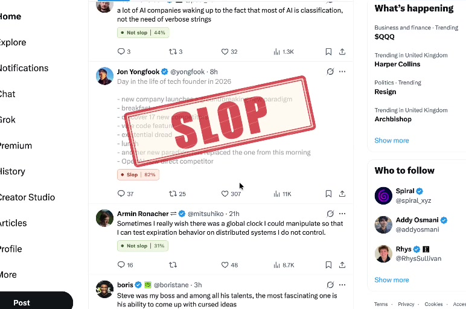
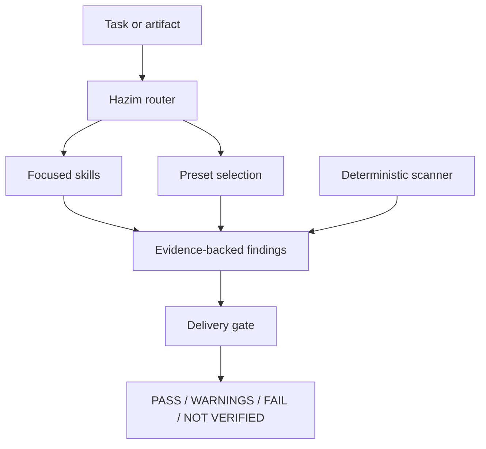

<div align="center">

# HAZIM UNIVERSAL ANTI-SLOP SKILLS

### A precision engineering framework for eliminating generic AI-era output

**Interfaces with identity. Prose with substance. Code that is complete. Delivery claims backed by evidence.**

[](https://github.com/hazim5-stack/hazim-universal-anti-slop-Skills/actions/workflows/ci.yml)
[](LICENSE)
[](CHANGELOG.md)
[](skills/)
[](#capability-map)
[](presets/)

[](docs/)
[](#language-support)
[](scripts/)
[](#privacy-and-execution-model)
[](registry/rules.json)

[](#agent-environments)
[](#agent-environments)
[](#agent-environments)
[](#agent-environments)
[](#agent-environments)

Created and curated by **Hazim Batwa**<br>

### See Hazim Universal Anti-Slop Skills in action

<a href="assets/showcase/hazim-universal-anti-slop-demo.mp4">
  
</a>

**[▶ Watch the 19-second project demo](assets/showcase/hazim-universal-anti-slop-demo.mp4)**

[Capability Map](#capability-map) | [Install](#installation) | [Presets](#curated-presets) | [Rulebook](docs/RULEBOOK.md) | [Architecture](#architecture) | [Credits](CREDITS.md)

</div>

---

## The engineering problem

AI-assisted development makes production faster. It also makes generic output easier to ship: transferable landing pages, decorative dashboards, unsupported claims, placeholder code, speculative architecture, empty tests, and confident completion reports without execution evidence.

Hazim Universal Anti-Slop Skills treats those failures as an engineering problem. It provides small, discoverable agent skills and deterministic checks that examine artifact quality without guessing who authored it.

> This project reports observable defects, risks, and weak signals. It does not claim to prove AI authorship.

## What this framework protects

| Surface | Typical failure | Framework response |
|---|---|---|
| UI | Familiar effects and card systems used without product meaning | Require purpose, hierarchy, complete states, and identity |
| UX | Attractive screens with incomplete journeys or disconnected controls | Trace the user job from entry through recovery and completion |
| Copy | Canned openings, empty reframes, buzzword density, synthetic rhythm | Preserve facts and voice while removing low-information structure |
| Code | TODOs, stubs, fake success, mock data in production paths | Scan deterministically and trace actual behavior |
| Architecture | New layers and dependencies without current consumers | Require proportionality, evidence, and minimal scope |
| Security | Generic checklists detached from changed behavior | Review concrete trust boundaries and data flows |
| Testing | Assertions that pass without proving behavior | Demand meaningful failures and observable outcomes |
| Delivery | "Production ready" without build, test, or runtime evidence | Return `NOT VERIFIED` instead of manufacturing confidence |

## Capability map

The repository contains **53 focused skills in 12 categories**. Skills remain independent so agents load only the context required by the task.

| Category | Skills | Primary concerns |
|---|---:|---|
| Core Orchestration | 4 | Routing, audit, repair, delivery decisions |
| UI and Visual Design | 6 | Identity, layout, density, components, motion, screenshots |
| UX and Product Integrity | 4 | User flows, forms, product truth, connected behavior |
| Copywriting and Human Voice | 6 | Arabic, English, voice protection, semantic preservation |
| Code Quality and Completeness | 5 | Placeholders, fake data, errors, comments, implementation |
| Architecture and Scope Control | 4 | Minimal diffs, abstractions, dependencies, refactors |
| Security and Privacy | 4 | Authorization, data lifecycle, secrets, configuration |
| Evidence and Substance | 5 | Attribution, specificity, deletion, inversion, meaning |
| Accessibility and Mobile | 3 | Accessibility, responsive behavior, RTL and bilingual UI |
| Testing and Readiness | 4 | Interaction tests, test quality, operations, verification |
| Repository and PR Quality | 4 | Commits, pull requests, repository gates, releases |
| Model Output | 4 | Corpus profiling, pattern registries, prompts, evaluation |

The canonical machine-readable inventory is [`registry/skills.json`](registry/skills.json).

<details>
<summary><strong>View all 53 skills</strong></summary>

| Category | Skill packages |
|---|---|
| Core | `hazim-antislop`, `hazim-antislop-audit`, `hazim-antislop-repair`, `hazim-antislop-delivery-gate` |
| UI | `hazim-ui-antislop`, `hazim-ui-originality`, `hazim-ui-component-integrity`, `hazim-ui-density-layout`, `hazim-ui-motion`, `hazim-ui-screenshot-audit` |
| UX | `hazim-ux-antislop`, `hazim-user-flow-review`, `hazim-form-antislop`, `hazim-product-reality-check` |
| Copy | `hazim-copy-antislop`, `hazim-arabic-copy`, `hazim-english-copy`, `hazim-voice-protection`, `hazim-copy-semantic-guard`, `hazim-copy-linter` |
| Code | `hazim-code-antislop`, `hazim-placeholder-detector`, `hazim-stub-fake-data-audit`, `hazim-error-handling`, `hazim-comments-docstrings` |
| Architecture | `hazim-minimal-diff`, `hazim-architecture-antislop`, `hazim-dependency-gate`, `hazim-no-drive-by-refactor` |
| Security | `hazim-security-review`, `hazim-data-privacy`, `hazim-authz-ownership`, `hazim-secret-config-audit` |
| Evidence | `hazim-substance-review`, `hazim-deletion-test`, `hazim-inversion-test`, `hazim-attribution-check`, `hazim-specificity-test` |
| Accessibility | `hazim-accessibility`, `hazim-mobile-layout`, `hazim-rtl-bilingual` |
| Testing | `hazim-interaction-smoke-test`, `hazim-test-quality`, `hazim-operational-readiness`, `hazim-no-fake-verification` |
| Repository | `hazim-pr-hygiene`, `hazim-commit-quality`, `hazim-pr-gate`, `hazim-release-gate` |
| Model output | `hazim-model-output-profile`, `hazim-slop-registry`, `hazim-prompt-antislop`, `hazim-generation-evaluator` |

</details>

## Architecture



The framework uses progressive disclosure:

1. Skill metadata enables discovery.
2. The selected `SKILL.md` supplies its operating contract.
3. Registries and references provide conditional detail.
4. Deterministic scripts enforce checks that should not depend on model memory.

## Installation

### Complete collection

```bash
npx skills add hazim5-stack/hazim-universal-anti-slop-Skills --all
```

### One focused skill

```bash
npx skills add hazim5-stack/hazim-universal-anti-slop-Skills \
  --skill hazim-ui-antislop
```

### Development checkout

```bash
git clone https://github.com/hazim5-stack/hazim-universal-anti-slop-Skills.git
cd hazim-universal-anti-slop-Skills
python3 scripts/validate_repository.py
python3 -m unittest discover -s tests -v
```

Manual installation is also supported: copy selected directories from `skills/` into the path recognized by your agent. Do not load all 53 by reflex; select a preset or the smallest relevant set.

## Agent environments

Each package uses the portable `SKILL.md` layout and includes `agents/openai.yaml` metadata.

| Environment | Packaging status | Typical project location |
|---|---|---|
| OpenAI Codex | Compatible skill structure | `.codex/skills/` or configured path |
| Claude Code | Compatible skill structure | `.claude/skills/` |
| Cursor | Compatible skill structure | `.cursor/skills/` or `.agents/skills/` |
| OpenCode | Compatible skill structure | `.opencode/skills/` or `.agents/skills/` |
| Other Agent Skills clients | Structurally compatible when `SKILL.md` discovery exists | Client-defined |
| Plain chat interfaces | Manual use | Paste the selected skill instructions |

Compatibility refers to the package structure. Runtime discovery can vary by client version and local configuration.

## Language support

| Layer | English | Arabic | Other UTF-8 languages |
|---|---:|---:|---:|
| Repository documentation | Full | Not used | Not used |
| Skill instructions | Full | Content-aware | Content-aware |
| Human-voice review | Full | Dedicated skill | Adaptable with a supplied profile |
| RTL and bilingual UI review | Full | Dedicated skill | Directionality principles apply |
| Deterministic prose patterns | Initial rule set | Planned expansion | Unicode sanitation only |
| Code and repository review | Language-agnostic guidance | Language-agnostic guidance | Language-agnostic guidance |

Repository source code, comments, configuration, tests, and documentation are English-only. Arabic is treated as a first-class analysis target rather than translated English syntax.

## Programming-language coverage

The advisory skills can review any codebase understood by the active agent. The bundled scanner operates on UTF-8 text and ships conservative cross-language patterns.

| Ecosystem | Advisory review | Deterministic text scan |
|---|---:|---:|
| TypeScript / JavaScript | Yes | Yes |
| Python | Yes | Yes |
| Rust / Go | Yes | Yes |
| Java / Kotlin | Yes | Yes |
| Swift | Yes | Yes |
| C# / C / C++ | Yes | Yes |
| HTML / CSS / Markdown | Yes | Yes |
| Configuration files | Yes | Yes when UTF-8 text |

Deterministic coverage does not imply AST-level analysis for every language. The initial scanner is regex-based and reports inspectable matches.

## Curated presets

| Preset | Workload | Included focus |
|---|---|---|
| `web-app` | Web products | UI, UX, code, accessibility, interactions |
| `mobile-app` | iOS and Android | Mobile layout, RTL, flows, privacy |
| `backend` | APIs and services | Code, architecture, security, tests, operations |
| `typescript` | TS/JS systems | Dependencies, errors, security, test quality |
| `content` | Publishing | Copy, voice, semantics, attribution |
| `arabic-content` | Arabic publishing | Register, voice, semantics, specificity |
| `government-docs` | Formal documents | Arabic formality, evidence, attribution, substance |
| `open-source` | Public repositories | Minimal diffs, PR hygiene, security, placeholders |
| `production-release` | Release candidates | Delivery evidence, operations, release controls |
| `strict` | High assurance | Cross-domain blocking gates |

Presets list focused skills. They do not concatenate every instruction into one oversized prompt.

## Deterministic scanner

```bash
# Scan a repository
python3 scripts/hazim_antislop.py .

# Restrict the domain
python3 scripts/hazim_antislop.py src/ --domain code

# Produce machine-readable findings
python3 scripts/hazim_antislop.py docs/ --domain copy --format json

# Report without failing the process
python3 scripts/hazim_antislop.py . --fail-on none
```

The initial registry detects unresolved implementation markers, temporary behavior, explicit stubs, empty catch blocks, chatbot residue, generic openings and reframes, unsupported attribution, generic marketing promises, and hidden control characters.

## Finding contract

| Field | Meaning |
|---|---|
| `Rule` | Stable finding identifier |
| `Location` | File, line, screen, component, or text span |
| `Evidence` | Observable fact that triggered review |
| `Impact` | Why the issue matters in context |
| `Confidence` | High, medium, or low certainty |
| `Action` | Smallest complete remediation |

| Verdict | Meaning |
|---|---|
| `PASS` | Relevant checks ran and no blocking defect remains |
| `PASS WITH WARNINGS` | No blocker remains; documented risks exist |
| `FAIL` | An evidence-backed blocking defect remains |
| `NOT VERIFIED` | Required evidence could not be collected |

## Why there is no universal score

A single score hides incompatible questions. Natural prose can contain invented facts. Minimal code can be insecure. A polished interface can be inaccessible. A large pull request can still be necessary.

The framework evaluates specificity, substance, accuracy, voice, originality, completeness, security, accessibility, and operational readiness separately.

## Privacy and execution model

- Skills require no external API by default.
- The deterministic scanner runs locally using the Python standard library.
- No telemetry or analytics are included.
- External model review is disabled by default.
- Private source or prose must not be transferred without explicit authorization.
- Future hooks must document permissions and data flow before release.

## Engineering validation

```bash
python3 scripts/validate_repository.py
python3 -m unittest discover -s tests -v
```

Continuous integration validates the complete registry, package names, presets, attribution, unfinished scaffold markers, scanner behavior, and the English-only implementation policy.

## Repository structure

```text
hazim-universal-anti-slop-Skills/
|-- .github/          Workflows and contribution templates
|-- docs/             Rulebook and source synthesis map
|-- presets/          Ten curated skill selections
|-- registry/         Canonical skill and rule data
|-- scripts/          Scanner, validator, and scaffolding
|-- skills/           Fifty-three installable packages
|-- tests/            Behavior-focused tests
|-- AGENTS.md         Repository agent policy
|-- CONTRIBUTING.md   Rule contribution standard
|-- CREDITS.md        Attribution and license notes
|-- SECURITY.md       Security and data handling
`-- LICENSE           MIT license
```

## Source discipline

The project synthesizes lessons from anti-slop skills, linters, repository gates, design criticism, and model-training research without importing their code or prose wholesale.

- [`docs/SOURCE-MAP.md`](docs/SOURCE-MAP.md) records architectural influence.
- [`CREDITS.md`](CREDITS.md) records upstream projects and observed licensing constraints.
- Third-party names remain the property of their owners.
- Acknowledgement does not imply endorsement.

## Contributing

Every proposed rule needs a stable ID, narrow failure definition, positive fixture, counterexample, severity policy, suppression path when deterministic, and review date when the signal can age. Read [`CONTRIBUTING.md`](CONTRIBUTING.md) before submitting changes.

## Roadmap

- Expand deterministic Arabic prose rules using native Arabic corpora.
- Add rule-specific positive and counterexample fixtures.
- Add optional AST adapters without replacing the portable scanner.
- Build screenshot and DOM evidence adapters for UI audits.
- Publish versioned preset bundles and installer metadata.
- Add reproducible evaluation corpora and false-positive reporting.

## Author

### Hazim Batwa

Hazim Universal Anti-Slop Skills reflects a systems-engineering approach to AI-assisted development: focused context, deterministic enforcement where possible, explicit trust boundaries, measurable delivery evidence, and respect for product identity.

**Project role:** creator, software engineer, systems designer, taxonomy architect, and technical curator.

## License

Released under the [MIT License](LICENSE). Copyright (c) 2026 Hazim Batwa.

---

<div align="center">

**Build with AI. Ship with engineering discipline.**

`HAZIM UNIVERSAL ANTI-SLOP SKILLS`

</div>
